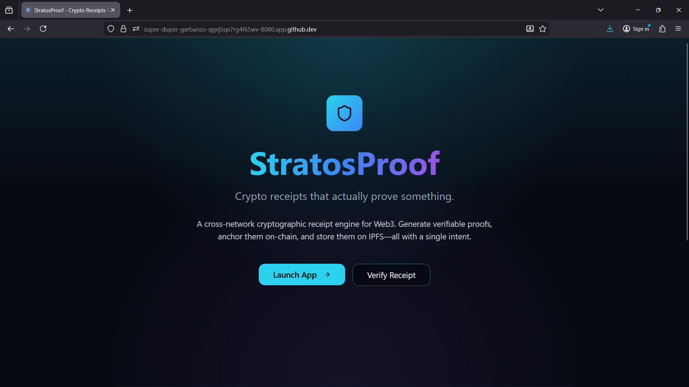
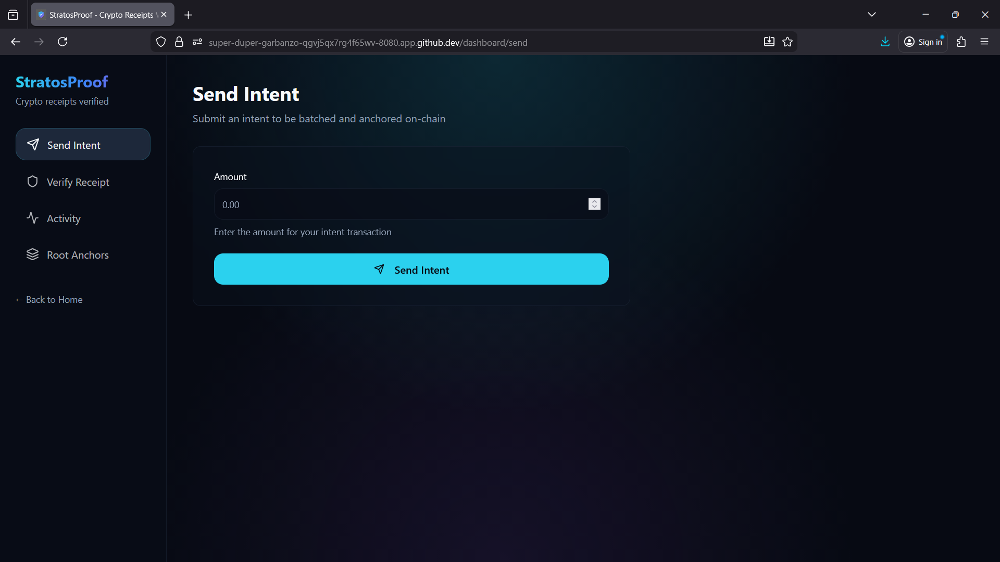
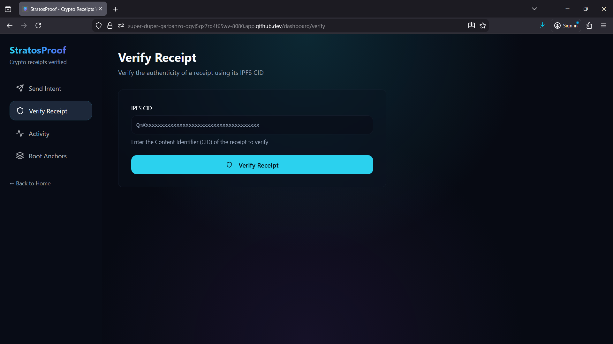

# StratosProof

Universal Receipt Layer: Cross-rollup proof API that gives verifiable receipts of L2→L3 interactions

🌌 Why StratosProof?

Current rollup UX has a critical flaw:

Users send intents (bridges, swaps, claims, governance votes)

L3s forward actions to L2s

Bridges queue messages

Sequencers reorder or batch transactions

Yet there is no cryptographic evidence of what the user actually intended if something goes wrong.

StratosProof gives users cryptographically verifiable receipts for every cross-rollup action.

🧩 How It Works

User → fireIntent() → L2 Contract
                     ↓
          [CrossIntent Event Emitted]
                     ↓
      Indexer collects batch of digests (3)
                     ↓
         Builds Merkle Tree (keccak256)
                     ↓
       Anchors Merkle Root on Verifier Contract
                     ↓
    Stores full receipt JSON on IPFS (cid)
                     ↓
        User gets a universal proof CID
                     ↓
      Frontend verifies receipt against on-chain root

UI FLOW:

✨ Core Features
🔹 1. Cross-Rollup User Intent Logging

Every user action triggers:
event CrossIntent(address user, uint256 amount, uint256 id, uint256 timestamp)

🔹 2. Deterministic Merkle Tree Receipts

Every 3 events → batch processed → Merkle tree → root anchored.

🔹 3. On-Chain Root Verification

Anyone can validate:

leaf digest

Merkle branch

on-chain root

batch anchor tx

🔹 4. IPFS-backed Receipts

Receipts live on decentralized storage:
{
  digest,
  root,
  index,
  proof[],
  allDigests[],
  anchorTx
}

🔹 5. One-Click Verification UI

Paste a CID → instantly shows:

✔ VALID
❌ INVALID
⧗ INTEGRITY FAILED
⧗ TAMPERED

⚙️ Tech Stack
Smart Contracts

Solidity

Arbitrum Sepolia (L2 testnet)

Events, Merkle root anchoring

Backend Indexer

Node.js

ethers.js

keccak256

Merkle tree builder

IPFS upload

Frontend

React + Vite

Wagmi + ethers v6

Wallet connection

Fire intent / verify CID UI

📦 Project Structure

StratosProof/
│
├── contracts/
│   ├── IntentEmitter.sol
│   ├── StratosProofVerifier.sol
│   └── Deploy.s.sol
│
├── indexer/
│   ├── src/index.ts
│   ├── src/merkle.ts
│   ├── src/receipt.ts
│   ├── src/config.ts
│   └── .env
│
├── frontend/
│   ├── src/components/
│   ├── src/abi/
│   ├── src/pages/
│   ├── .env
│   └── package.json
│
└── scripts/
    └── deploy.sh
